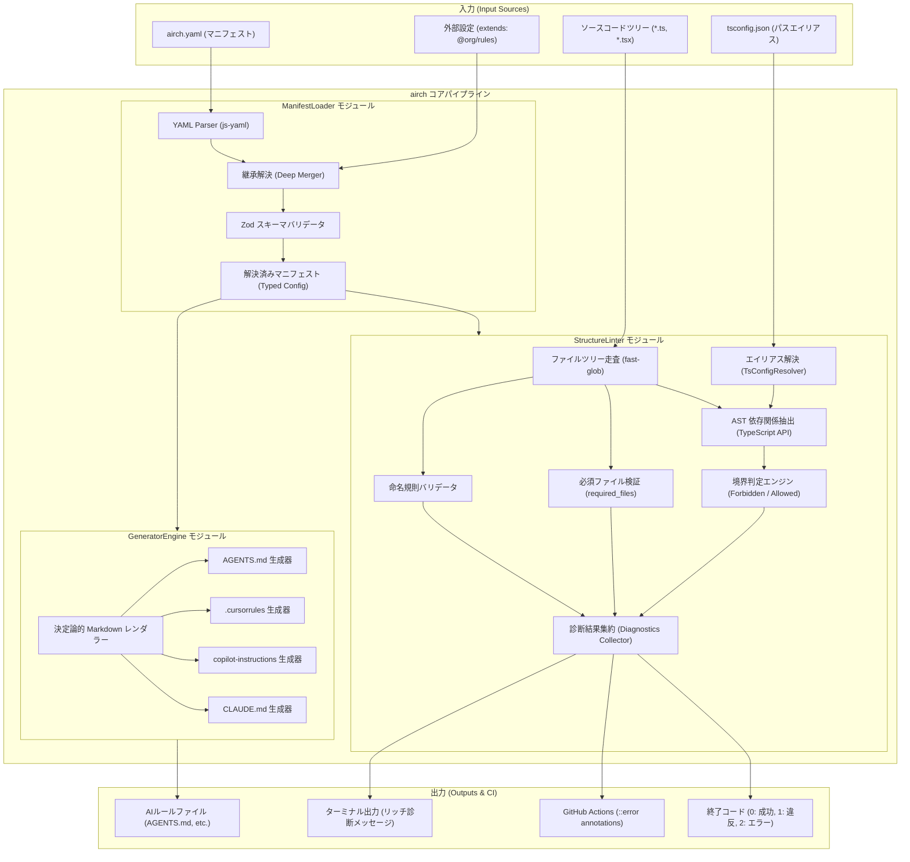

# システムアーキテクチャ設計書 (System Architecture)

- **プロダクト名**: `airch`
- **対象バージョン**: 1.0.0
- **ステータス**: Approved
- **作成日**: 2026-09-26

---

## 1. ハイレベルアーキテクチャ概要

`airch` は、Node.js / TypeScriptで構築された、依存関係の少ない高効率なモジュラーCLIツールです。
単一のマニフェストファイル（`airch.yaml`）を核として、パーサー、生成エンジン、および構造リンターが疎結合に連携します。

### 1.1 全体アーキテクチャ & データフロー図



---

## 2. コアモジュール設計と責務

システムは以下の主要モジュールから構成されます。

### 2.1 `ManifestLoader` (マニフェスト読み込み・検証)
マニフェストファイルの探索、YAMLパース、継承関係の解決、およびZodによる厳格な型検証を担当します。

- **主要責務**:
  1. **ファイル探索**: カレントディレクトリから `airch.yaml`, `airch.yml` を探索。
  2. **パース**: `js-yaml` を用いた高速かつ安全なYAMLパース。
  3. **継承解決 (`extends`)**: `extends` プロパティが存在する場合、ローカル相対パスまたは `node_modules` から親設定をロードし、`deepmerge` でオーバーライド解決。
  4. **スキーマ検証**: 定義された Zod スキーマで検証し、違反がある場合はユーザーフレンドリーなエラーメッセージ（問題の行やプロパティ名）を出力して即座に終了。
- **インターフェース例**:
  ```typescript
  export interface IManifestLoader {
    load(configPath?: string): Promise<AirchManifest>;
  }
  ```

---

### 2.2 `GeneratorEngine` (決定論的AIルール生成)
マニフェストに定義されたアーキテクチャ境界と規約から、各種AIツール向けの設定ファイルを決定論的に生成します。

- **主要責務**:
  1. **テンプレート生成**: マニフェストの `project`, `structure`, `conventions`, `commands` をLLM（GPT-5.6, Claude 3.7, Grok 4.5）が最も理解しやすい構造化プロンプト形式へ変換。
  2. **ターゲット別フォーマット**:
     - `AGENTS.md`: 標準的なマルチエージェント/LLM向け共通仕様。
     - `.cursorrules`: Cursor IDEに最適化されたシステムルール。
     - `.github/copilot-instructions.md`: GitHub Copilot向けリポジトリレベル指示書。
     - `CLAUDE.md`: Claude Code CLI向けプロジェクトガイドライン。
  3. **決定論的出力の保証**:
     - ルールリスト、パス、コマンドの走査・展開順序をアルファベット順（辞書順）でソート。
     - 改行コード（LF）および余白を正規化。
     - 生成ファイル冒頭に自動生成メタデータコメントを付与（手動編集禁止の警告）。
- **インターフェース例**:
  ```typescript
  export interface IGeneratorEngine {
    generate(manifest: AirchManifest, targets: GeneratorTarget[]): Promise<GenerationResult[]>;
    diff(manifest: AirchManifest, targets: GeneratorTarget[]): Promise<boolean>;
  }
  ```

---

### 2.3 `StructureLinter` (構造リンター & 境界検証)
ファイルツリーとソースコードASTを解析し、マニフェストの規約を満たしているかを検証します。

- **主要責務**:
  1. **ファイルツリー探索 (`FileScanner`)**:
     - `fast-glob` を使用し、`.gitignore` や除外パターンを考慮して高速にファイル一覧を抽出。
  2. **命名規則の検証 (`NamingValidator`)**:
     - 各パスに対応するルール（`kebab-case`, `PascalCase`, 正規表現等）と、ファイル名・ディレクトリ名を照合。
  3. **必須ファイルの存在検証 (`FilePresenceValidator`)**:
     - モジュールディレクトリ直下に `required_files` で定義されたファイル（例: `index.ts`, `types.ts`）が存在するかを確認。
  4. **インポート境界の静的解析 (`BoundaryValidator` & `ASTAnalyzer`)**:
     - TypeScript Compiler API（または軽量AST抽出ライブラリ）を用いて、各ファイルから `import`, `export ... from`, `require()`, `import()` 文を抽出。
     - `tsconfig.json` の `compilerOptions.paths` を利用してパスエイリアスを実パスへ解決。
     - 送信元ファイルが属するモジュールのルールと照合し、`forbidden_imports` への一致または `allowed_imports` 外の参照を検出。
- **データ構造 (Diagnostic)**:
  ```typescript
  export interface LintDiagnostic {
    ruleName: string;
    filePath: string;
    line?: number;
    column?: number;
    severity: "error" | "warning";
    message: string;
    forbiddenTarget?: string;
    suggestion?: string;
  }
  ```

---

### 2.4 `UIServer` (GUI Bridge & WebSocket Server)
`airch ui` コマンドで起動する、ブラウザ向けローカルHTTPおよびリアルタイム通信サーバーです。

- **主要責務**:
  1. **静的アセット配信**: ビルド済みの `@genbuhase/airch-ui`（Vite SPA）をローカルポート（デフォルト: `4567`）で配信。
  2. **API エンドポイント**:
     - `GET /api/manifest`: 現在解決されている `airch.yaml` の内容を取得（マニフェスト未存在時は 500 エラーではなく `{ exists: false }` を返却）。
     - `POST /api/manifest`: GUI上で編集されたマニフェストを検証・保存。
     - `POST /api/init`: 未初期化プロジェクト向けに、指定プリセット（`feature-sliced`, `clean-architecture`, `layered` 等）で `airch.yaml` および初期AIルールを即時生成。
     - `GET /api/diagnostics`: 最新のアーキテクチャリント診断結果を取得。
     - `POST /api/generate`: AIルールファイルの即時再生成。
  3. **ファイル監視とプッシュ同期 (WebSocket / SSE)**:
     - ソースファイルまたは `airch.yaml` の変更をネイティブ `fs.watch` で検知し、ブラウザへ差分更新イベントを通知。

---

## 3. エラーハンドリング & 終了コード仕様 (Exit Codes)

CI/CD パイプラインでの自動化およびシェルスクリプト連携のため、終了コードを明確に階層化します。

### 3.1 終了コード定義
| 終了コード | 状態 | 発生条件 | CIでの推奨挙動 |
| :---: | :--- | :--- | :--- |
| **`0`** | **SUCCESS** | すべての検証に合格、または生成が正常に完了。 | パス（パイプライン継続） |
| **`1`** | **LINT_VIOLATION** | アーキテクチャ違反（境界違反、命名違反、必須ファイル欠落）が1件以上検出された。 | 失敗（PRマージをブロック） |
| **`2`** | **CONFIG_ERROR** | `airch.yaml` が見つからない、YAML構文エラー、Zodスキーマ検証エラー。 | 失敗（設定ミスを通知） |
| **`3`** | **INTERNAL_ERROR** | ファイル読み込み失敗（パーミッションエラー等）や予期しないランタイム例外。 | 失敗（バグ報告を促す） |

---

## 4. CI/CD 連携とレポーター仕様

CI環境下において、迅速に問題箇所を特定できるよう、複数の出力フォーマットを提供します。

### 4.1 フォーマット種別 (`--format`)
1. **`pretty` (デフォルト)**:
   - ターミナル向けのリッチカラー出力（Chalk / Picocolors）。
   - ファイル名、行番号、違反ルールの要約、および修正アドバイスを表示。
2. **`github`**:
   - GitHub Actions ワークフローコマンド形式。
   - `::error file={path},line={line},col={col}::{message}` を出力し、PRのFiles changedタブにインラインでエラーを表示。
3. **`json`**:
   - 機械可読なJSON形式。SonarQubeや社内ダッシュボード連携用。
4. **`sarif`**:
   - OASIS SARIF (Static Analysis Results Interchange Format) 準拠。GitHub Advanced Security の Code Scanning アラートに直接連携可能。

### 4.2 GitHub Actions での実行ワークフロー例
```yaml
name: Architecture Lint

on:
  pull_request:
    branches: [main, develop]

jobs:
  airch-check:
    runs-on: ubuntu-latest
    steps:
      - uses: actions/checkout@v4
      - uses: pnpm/action-setup@v3
        with:
          version: 9
      - uses: actions/setup-node@v4
        with:
          node-version: 22
          cache: "pnpm"
      - run: pnpm install --frozen-lockfile
      - name: Build monorepo packages
        run: pnpm build
      - name: Verify Architecture Boundaries
        run: pnpm airch check --strict --format github
      - name: Verify AI Rules Sync
        run: pnpm airch generate --check
```

---

## 5. モノレポ構造と疎結合設計 (Monorepo Architecture)

CLIおよびGUIツール（`airch ui`）の長期的な保守性と再利用性を高めるため、以下の3層パッケージ構成を採用します。

```text
airch/ (root: @genbuhase/airch-root)
├── packages/
│   ├── core/       # @genbuhase/airch-core
│   │               ├── ManifestLoader (YAMLパース, Zod検証)
│   │               ├── GeneratorEngine (Markdown決定論的生成)
│   │               └── StructureLinter (AST境界解析, 命名規則チェック)
│   │
│   ├── cli/        # @genbuhase/airch (ターミナル実行バイナリ)
│   │               ├── Commander CLI 定義 (init, generate, check, ui)
│   │               ├── UIServer (内蔵HTTP API & 静的アセット配信)
│   │               └── CI/CD レポーター (Console, GitHub, JSON, SARIF)
│   │
│   └── ui/         # @genbuhase/airch-ui (GUI Web Dashboard)
│                   ├── React 19 + Vite フロントエンド
│                   ├── Tailwind CSS v4 + DaisyUI 5
│                   └── @xyflow/react アーキテクチャグラフ
```

- **依存の方向性**:
  - `cli` ──> `core`
  - `ui` ──> `core` (型定義および共有ロジック)
  - `cli` は `ui` コマンド実行時に `ui` の静的ビルドアセットを内蔵HTTPサーバーで配信。
- **利点**:
  - コアエンジンに一切のUI依存・CLI依存が混入せず、純粋関数としてテスト容易性を最大化。
  - 将来的なVSCode拡張機能やGitHub App/SaaSバックエンドの開発時にも `@genbuhase/airch-core` をそのまま再利用可能。
